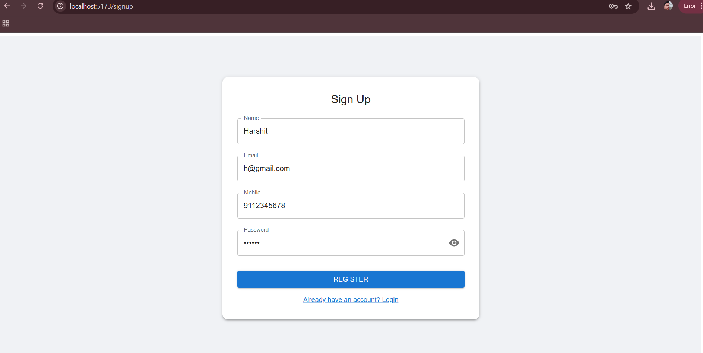
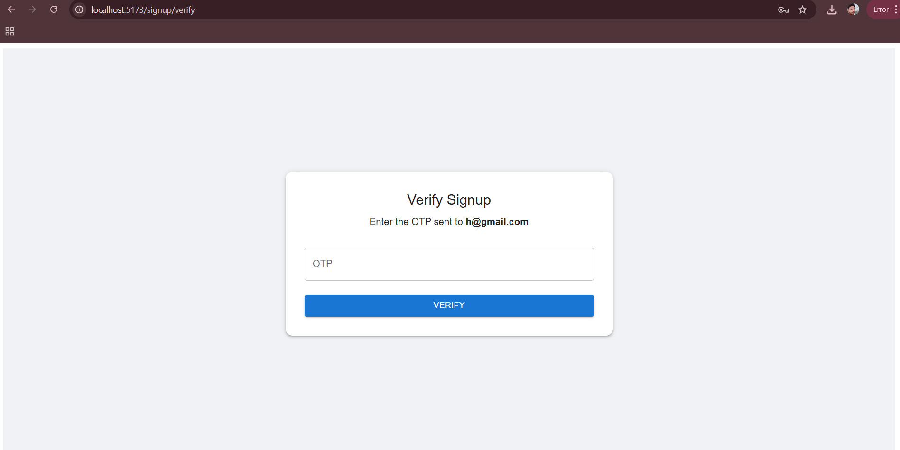
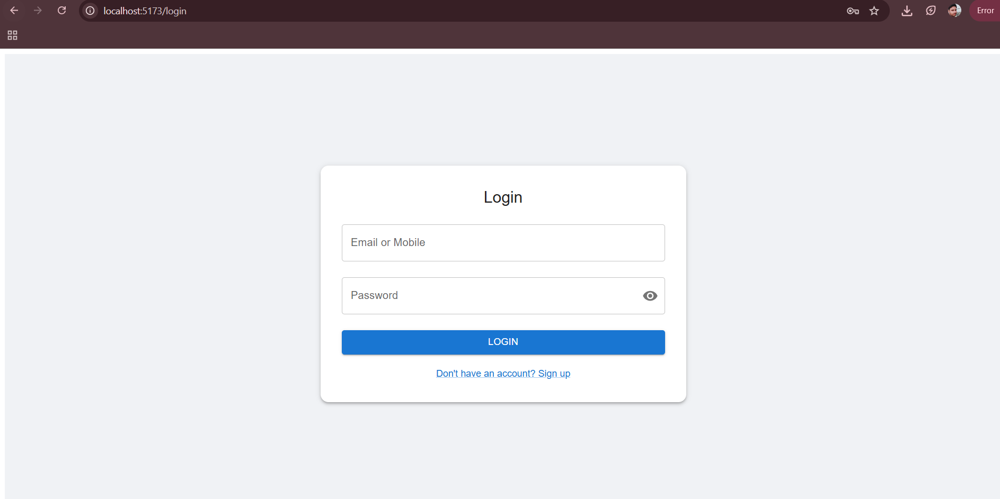
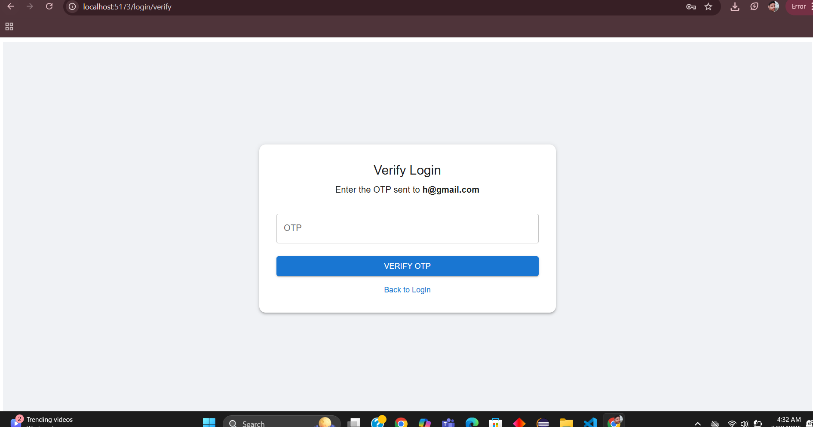
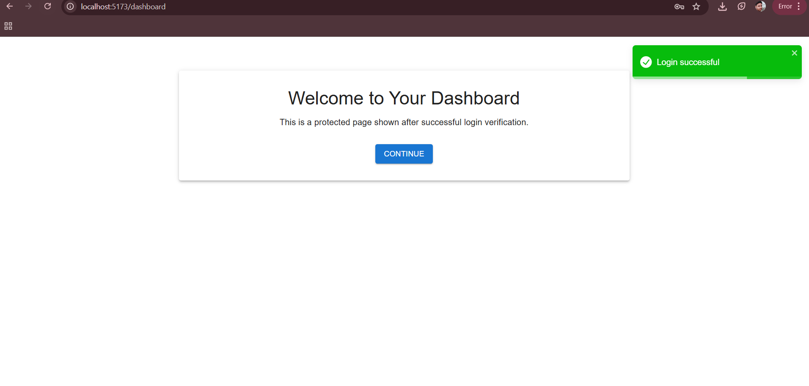
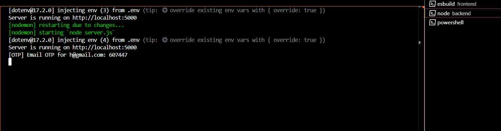

# Auth Flow (MUI + Vite + Express)

A full-stack authentication flow using React (Vite + MUI), Node.js, and Express with OTP-based verification and JWT token management using cookies. This project uses in-memory storage (no database) for demonstration purposes.

## 🌐 Live Project Structure

```
AUTH-FLOW/
├── backend/
│   ├── controllers/
│   ├── middleware/
│   ├── routes/
│   ├── .env
│   ├── package.json
│   └── server.js
├── frontend/
│   ├── public/
│   ├── src/
│   ├── .env
│   ├── package.json
│   └── vite.config.js
```

## 📦 Environment Setup

### 1. Clone the repo

```bash
git clone https://github.com/sharmaHarshit2000/auth-flow.git
cd auth-flow
```

### 2. Backend Setup

```bash
cd backend
npm install
```

Create a `.env` file:

```
PORT=5000
NODE_ENV=development
JWT_SECRET=your_access_token_secret
REFRESH_SECRET=your_refresh_token_secret
```

Start the backend:

```bash
npm run dev # or node server.js
```

### 3. Frontend Setup

```bash
cd frontend
npm install
```

Create a `.env` file:

```
VITE_API_URL=http://localhost:5000/api
```

Start the frontend:

```bash
npm run dev
```

## 🔐 Auth Flow

### ✅ Signup Flow

1. User signs up with name, email, mobile, and password.
2. OTP is generated and printed to console (for testing).
3. OTP is verified; user is marked as verified.

### ✅ Login Flow

1. User logs in with email/mobile and password.
2. OTP is generated and printed.
3. OTP verification sets JWT `accessToken` and `refreshToken` in cookies.

## 📌 Explanations

### 🔢 OTP Handling

- OTP is a 6-digit number generated and stored in-memory.
- OTP is valid for 5 minutes and stored like: `{ identifier: { otp, expiresAt } }`.
- OTP is printed to the console for testing/demo.

### 🍪 Cookie Storage

- Tokens (`accessToken`, `refreshToken`) are stored in HTTP-only cookies using `res.cookie()`.
- Secure and SameSite settings configured using:

```js
const COOKIE_OPTIONS = {
  httpOnly: true,
  sameSite: "Strict",
  secure: process.env.NODE_ENV === "production",
};
```

### 🔄 Refresh Token Implementation

- `accessToken` expires in 10 minutes.
- `refreshToken` expires in 1 day.
- On API 401 error, `refreshToken` is used to get a new `accessToken` (handled in frontend `axios` interceptor).
- On refresh failure, user is redirected to login.

## 🧩 Frontend Tech Stack

- React 19 + Vite 7
- MUI v7
- React Hook Form + Yup (validation)
- Axios + Interceptors
- React Router v7
- React Toastify

### Frontend Scripts

```json
"scripts": {
  "dev": "vite",
  "build": "vite build",
  "lint": "eslint .",
  "preview": "vite preview"
}
```

## 📸 Screenshots

### 🔐 Signup Page


### ✅ Signup OTP Verification


### 🔓 Login Page


### ✅ Login OTP Verification


### 📊 Dashboard


### 🛡️ Backend OTP Console


## 👤 Author

- GitHub: [sharmaHarshit2000](https://github.com/sharmaHarshit2000)